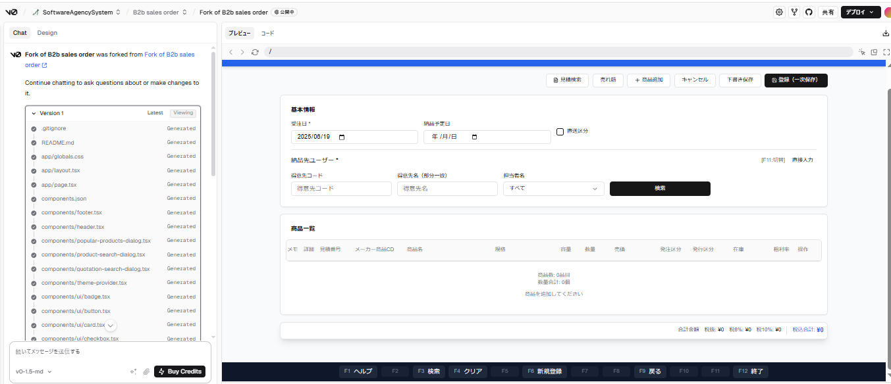

<!-- _class: cover -->
# AI駆動開発による要件定義の革新
**V0を活用した画面PoC実践報告**

**発表者：** 流通サービス部 通販サービスGr 笹尾 豊樹  
**日時：** 2025年6月19日

---

# 本日のアジェンダ

1. **背景・課題認識**
2. **実践案件概要**
3. **V0活用による成果**
4. **開発効率化への直接貢献**
5. **課題と対策**
6. **今後の展開**
7. **まとめ**

---

# 背景・課題認識
### 従来の要件定義における課題

- **抽象的な議論** → 認識齟齬が発生しやすい
- **画面イメージの共有困難** → 後戻り工数が発生
- **バックエンド処理の理解不足** → 設計段階での仕様変更

### AI駆動開発導入の狙い
- 早期の視覚的コミュニケーション実現
- 要件の具体化・明確化
- 開発工数の削減

---

# 実践案件概要
### BtoB向け販売管理システム開発

- **現在のフェーズ：** 要件定義中
- **対象業務：** 見積作成、受注処理
- **V0活用範囲：** 主要画面のPoC作成

### 作成した画面PoC
- 見積画面
- 受注画面  
- その他関連画面

---

# V0による画面PoC作成プロセス
### 実際の操作フロー

1. **要件をプロンプトで入力**
2. **リアルタイムで画面生成**
3. **即座に操作・確認**
4. **フィードバック反映**

#### **V0の特徴**
- プロンプトベースの直感的操作
- リアルタイムプレビュー
- コンポーネント単位での編集
- 即座のコード生成

---

# V0活用による成果
### 🎯 要件明確化への貢献

#### **早期UIコンセンサス**
- **従来：** 画面仕様書 → レビュー → 修正 → 再レビュー
- **V0活用後：** 画面PoC → 即座に操作・確認 → リアルタイム修正

#### **バックエンド処理の可視化**
- 画面操作フローでビジネスロジックを体感
- データの流れを具体的にイメージ化
- 例外処理パターンの早期発見

---

# クライアントとの要件確認セッション
### 💡 実際の声

> **「画面を実際に触れるので、要件のイメージが格段に掴みやすい」**

#### **セッションの流れ**
1. V0で作成したPoCを画面共有
2. クライアントが実際に操作
3. リアルタイムでフィードバック収集
4. その場で修正・改善

- 操作性への具体的フィードバック
- 業務フローの改善提案
- 追加要件の早期発見

---

# 開発効率化への直接貢献
### 🚀 ソース資産の継続活用

#### **PoCから開発への直接転換**
- **GitHubリポジトリ管理によるソース流用**
  - V0で生成されたコンポーネントをリポジトリで管理
  - 開発フェーズで直接clone・カスタマイズ
  - バージョン管理による変更履歴の追跡

---

# 品質向上効果
### 📊 定量的効果（見込み）

| 項目 | 従来 | V0活用後 | 改善効果 |
|------|------|----------|----------|
| **要件確定速度** | 100% | 130% | **+30%** |
| **画面開発工数** | 100% | 60% | **-40%** |
| **手戻り工数** | 100% | 50% | **-50%** |

#### **その他の効果**
- 画面レイアウト・UIコンポーネントの流用
- 画面仕様の曖昧さを事前排除
- デザインシステムの統一化
- テスト項目の早期洗い出し

---

# 課題と対策
### ⚠️ 運用上の留意点

#### **「設計作業化」の傾向**
- **課題：** 要件定義が詳細設計に踏み込みがち
- **対策：** 
  - PoC作成の目的を明確化（要件確認 vs 設計）
  - 適切な抽象度レベルの維持
  - 定期的な作業範囲の見直し

#### **境界線管理の重要性**
- 要件定義フェーズでの成果物定義
- 次フェーズへの引き継ぎルール策定

---

# 今後の展開
### 🔄 水平展開の可能性

- **他案件への適用**
  - Webアプリケーション開発案件
  - UI/UXが重要な業務システム

### 📈 さらなる効率化
- **AI開発チェーンの構築**
  - **V0 → GitHub → Cline**の連携フロー
  - V0のPoCをインプットとしてClineで設計書自動生成
  - バックエンド実装の自動化

---

# AI駆動開発チェーンの実現
### V0 → Cline連携による一気通貫開発

#### **連携フローの詳細**
- V0で作成したPoCをClineが解析
- 自動で設計書・仕様書を生成
- バックエンドAPIの実装も自動化
- テストコードまで一括生成

---

# AI駆動開発プロセス
### 従来との比較

#### **従来プロセス**
要件定義 → 設計書作成 → 実装 → テスト

#### **AI駆動プロセス**
V0 PoC → Cline設計書生成 → Cline実装 → テスト

**⚡ 30%の開発速度向上を実現**

### 🎯 組織への価値提供
- 受託開発の競争力向上
- クライアント満足度の向上
- 開発チームのスキル向上

---

# まとめ
### 🌟 V0活用の核心価値

1. **「触れる要件定義」の実現**
   - 抽象的議論から具体的体験へ
   - クライアントとの認識齟齬を大幅削減

2. **開発資産としての継続価値**
   - PoCから本開発への直接的価値転換
   - 開発工数削減と品質向上の両立

3. **AI駆動開発のモデルケース**
   - 従来手法の限界突破
   - 新しい開発スタイルの確立

---

# 次のアクション
### 🚀 実行計画

- 現案件での本格運用継続
- **V0 → Cline連携フローの実践検証**
- 他案件への展開検討
- 社内ナレッジ共有・標準化

---

# ご質問・ご意見をお聞かせください

**ありがとうございました**
